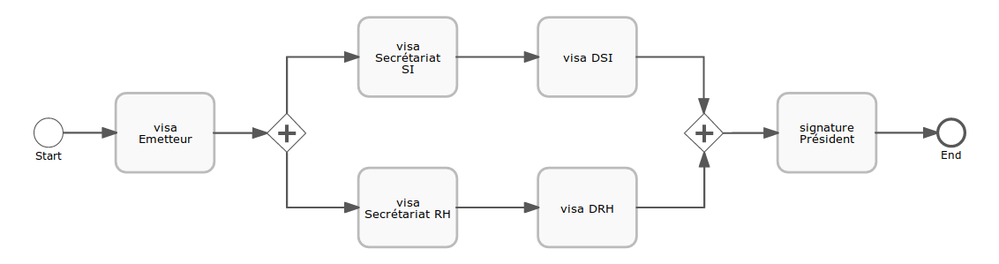
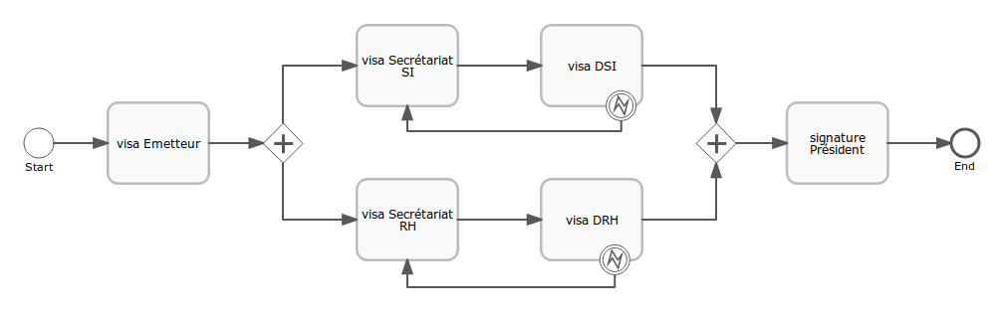

i-Parapheur
===========

## Installation

```bash
$ docker-compose up
```

#### Matomo post-install setup

`http://iparapheur.dom.local:9080` for the installation page.  
Click "Next" on the firsts pages. Values are set by Docker's environment variables.  

```
Matomo root user : admin
Matomo root pass : *****

Site name        : iparapheur
Site url         : iparapheur.dom.local
```

* Administration (top-left cog)
* Store (in the left menu)
* Install plugin `Custom Dimensions`

This plugin will be set by default in Matomo v.4.x, thus this step will not be necessary anymore.

* Administration (top-left cog)
* Custom Dimensions (in the left menu)
* Action Dimensions : Configure a new dimension...
  * Name : `Bureau`
  * Active : ✓
  * Save


## Sub-services

### Flowable

#### Standalone run

Download and run it, according to the [official documentation](http://www.flowable.org/docs/userguide/index.html#download).  
Or use the official Docker image : `docker run -p8080:8080 flowable/flowable-rest`.

#### Uploading basic tasks definitions

```bash
$ cd ip-core
$ curl --user rest-admin:test -F "file=@src/main/resources/bpmn/visa.bpmn20.xml" http://localhost:8080/flowable-rest/service/repository/deployments
$ curl --user rest-admin:test -F "file=@src/main/resources/bpmn/signature.bpmn20.xml" http://localhost:8080/flowable-rest/service/repository/deployments
$ curl --user rest-admin:test -F "file=@src/main/resources/bpmn/second_opinion.bpmn20.xml" http://localhost:8080/flowable-rest/service/repository/deployments
```

#### Creating a workflow

##### Flowable-modeler

Create a simple workflow.  
Predefined tasks should be `callActivity` tasks, by convention, we name them `visa xxx`, or `signature xxx`.



... And download the `bpmn20.xml` file.


##### Defining the sub-activity

Every sub-activities should call as `visa` or a `signature` activity.  

An `xslt` patcher can define those steps automatically, if their names is set properly (starting with `visa` or `signature`) :
```bash
$ xsltproc src/main/resources/patches/callActivity_attributes.xslt workflow.bpmn20.xml
```

##### Defining user candidates

Every sub-activities can manage their candidates with input variables. Two should be defined as `In parameters` :
- `current_candidate_groups`, the main task candidate(s)
- `previous_candidate_groups`, the previous main one who can call the undo task.

An `xslt` patcher can define those steps automatically, if their names is set properly (starting with `visa` or `signature`) :
```bash
$ xsltproc src/main/resources/patches/callActivity_candidates.xslt workflow.bpmn20.xml
```

##### Defining undo events

Every consecutive `callActivity` steps should be linked with a `boundaryEvent`, assigned to the `undo` error.  
For now, only consecutive steps can be undone. Intermediate events (like parralel gates) will disallow this step.



An `xslt` patcher can define those steps automatically :  
```bash
$ xsltproc src/main/resources/patches/callActivity_undo.xslt workflow.bpmn20.xml
```
*Note : This patch removes the existing BPMN diagram : Since it adds elements, it will most likely break it anyway.*

##### TL;DR
Name your tasks `{visa|signature} target_desk` and do that :

```bash
$ cp workflow.bpmn20.xml /tmp/temp0.bpmn20.xml
$ xsltproc src/main/resources/patches/set_process_executable.xslt  /tmp/temp0.bpmn20.xml > /tmp/temp1.bpmn20.xml
$ xsltproc src/main/resources/patches/callActivity_attributes.xslt /tmp/temp1.bpmn20.xml > /tmp/temp2.bpmn20.xml
$ xsltproc src/main/resources/patches/callActivity_attributes.xslt /tmp/temp2.bpmn20.xml > /tmp/temp3.bpmn20.xml
$ xsltproc src/main/resources/patches/callActivity_candidates.xslt /tmp/temp3.bpmn20.xml > /tmp/temp4.bpmn20.xml
$ xsltproc src/main/resources/patches/callActivity_undo.xslt       /tmp/temp4.bpmn20.xml > /tmp/temp5.bpmn20.xml
$ cp /tmp/temp5.bpmn20.xml workflow_patched.bpmn20.xml
```


#### Starting a workflow

Uploading the workflow definition :
```bash
$ curl --user rest-admin:test -F "file=@parallel_workflow.bpmn20.xml" http://localhost:8080/flowable-rest/service/repository/deployments
```

Instantiating the workflow :
```bash
$ curl --user rest-admin:test -H "Content-Type: application/json" -X POST -d '{"processDefinitionKey": "simple_workflow", "variables": [{"name":"workflow_instance_id", "value":"my_id"}]}' http://localhost:8080/flowable-rest/service/runtime/process-instances
```

#### Listing tasks by candidates
```bash
$ curl --user rest-admin:test -H "Content-Type: application/json" -X POST -d '{ "candidateGroup" : "Emetteur" }' http://localhost:8080/flowable-rest/service/query/tasks
```
```json
{
  "data": [
    {
      "id": "6255",
      "url": "http://localhost:8080/flowable-rest/service/runtime/tasks/6255",
      "category": "my_id",
      /*...*/
    }
  ],
  "total": 1,
  "start": 0,
  "sort": "id",
  "order": "asc",
  "size": 1
}
```

#### Performing tasks
```bash
$ curl --user rest-admin:test -H "Content-Type: application/json" -X POST -d '{ "action" : "complete", "variables" : [ { "name" : "approved", "value" : true}, { "name" : "action", "value" : "'visa'"} ]  }' http://localhost:8080/flowable-rest/service/runtime/tasks/6255
```
*Reusing the previous task ID, returned in the list request.*
